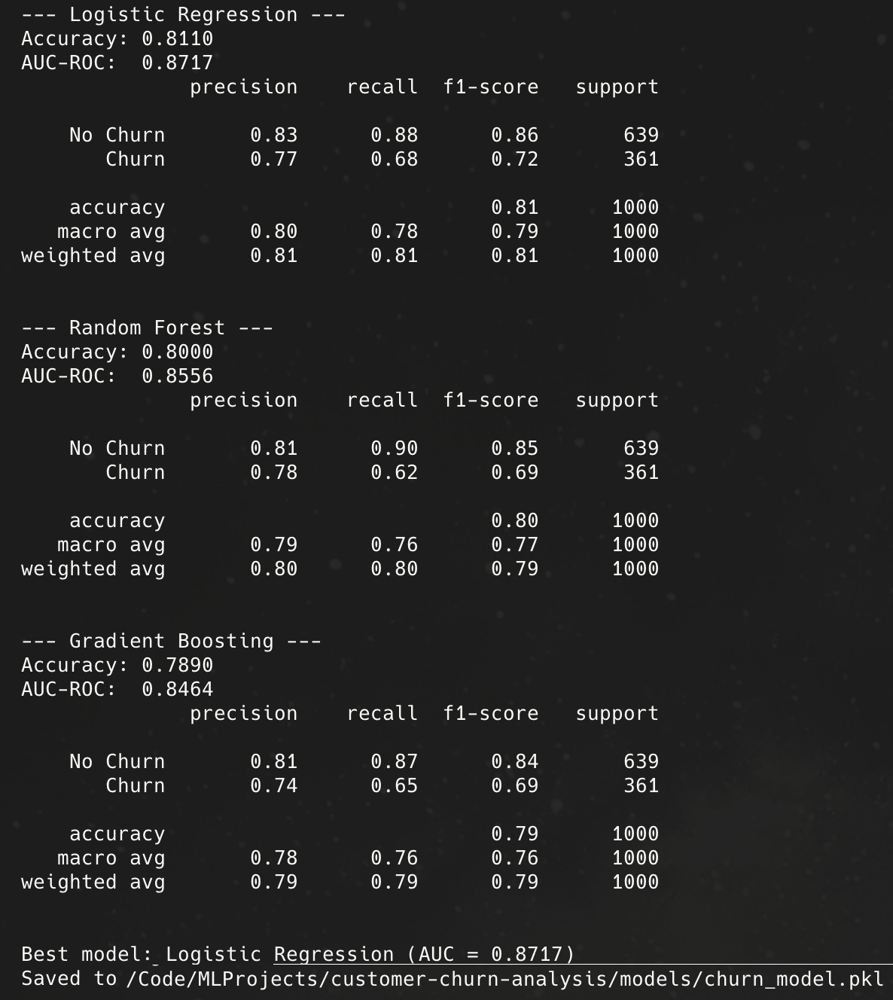

# Customer Churn Analysis

End-to-end ML project for predicting customer churn. Covers data generation,
DuckDB ingestion, exploratory analysis, model training, and a Flask web app.

## Project Structure

```
customer-churn-analysis/
├── config.py                # path configuration
├── run_pipeline.py          # run full pipeline in one go
├── requirements.txt
├── data/
│   ├── raw/                 # raw generated CSV
│   ├── processed/           # train/test splits
│   └── churn.duckdb         # DuckDB database
├── src/
│   ├── ingest.py            # data generation + DuckDB load
│   ├── preprocess.py        # cleaning + feature encoding
│   ├── train.py             # model training + evaluation
│   └── predict.py           # prediction utility
├── notebooks/
│   └── 01_eda.ipynb         # exploratory data analysis
├── models/
│   └── churn_model.pkl      # saved model
└── app/
    ├── app.py               # Flask web app
    └── templates/
        └── index.html
```

## Setup

```bash
python -m venv venv
source venv/bin/activate
pip install -r requirements.txt
```

## Run the Pipeline

Run everything at once:

```bash
python run_pipeline.py
```

Or step by step:

```bash
python -m src.ingest        # generate data and load into DuckDB
python -m src.preprocess    # preprocess and split data
python -m src.train         # train models and save the best one
```

## Model Performance

After running the training pipeline, the best model is selected based on AUC-ROC score. The training output compares Logistic Regression, Random Forest, and Gradient Boosting models.



_The Logistic Regression model was selected as the best performer with an AUC-ROC of 0.8717._

## Explore

```bash
jupyter notebook notebooks/01_eda.ipynb
```

## Web App

```bash
python app/app.py
```

Open http://localhost:5000 in your browser.

## Demo

The Flask application provides a user-friendly interface to input customer details and receive immediate churn predictions.


_The interface allows users to enter information such as tenure, monthly charges, and service details to assess churn risk._

### API

```bash
curl -X POST http://localhost:5000/api/predict \
  -H "Content-Type: application/json" \
  -d '{
    "age": 35, "tenure": 6, "monthly_charges": 85.5, "total_charges": 510.0,
    "gender": "Male", "contract": "Month-to-month",
    "payment_method": "Electronic check", "internet_service": "Fiber optic",
    "online_security": "No", "tech_support": "No"
  }'
```
